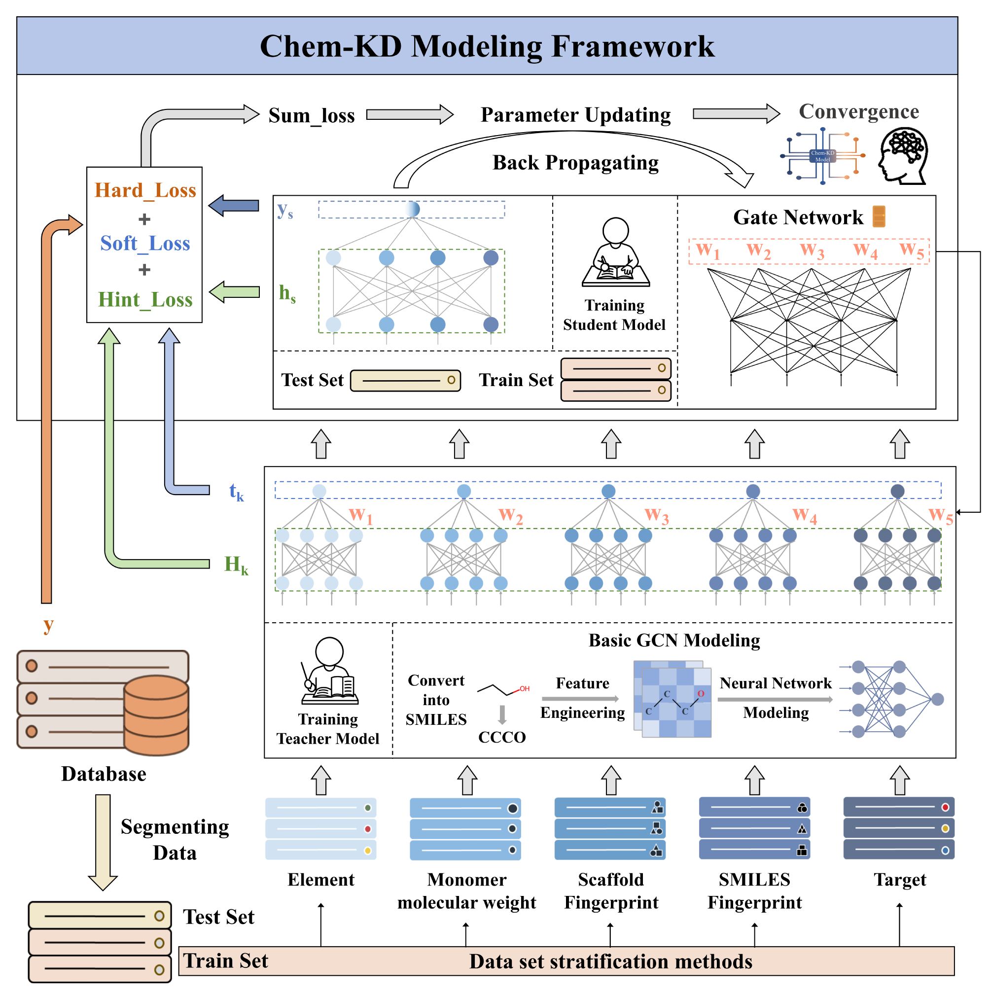

# Chem-KD: Multi-View Knowledge Distillation Framework for Data-Scarce Chemical Learning

Chem-KD predicts polyimide glass transition temperature (Tg) and dielectric constant (DC) from limited labeled data. It combines five chemistry-informed teacher models into one student model through knowledge distillation.

The repository includes datasets, extracted features, trained models, and Jupyter notebooks for training, prediction, and ablation studies.



*Figure 1. Overview of the Chem-KD modeling framework.*

## Contents

- [Project structure](#project-structure)
- [Data](#data)
- [Requirements](#requirements)
- [Usage](#usage)
- [Notes](#notes)

## Project structure

| Folder | Task |
|---|---|
| `1_GCN_Tg/` | Tg prediction with GCN; includes six ablation studies |
| `2_GCN_DC(+freq)/` | DC prediction with GCN and measurement frequency |
| `3_GAT_Tg/` | Tg modeling with GAT |

Each task folder contains:

```text
0_Database/           Datasets, features, and trained models
1_Feature_Extractor/  Convert molecular structures into graph features
2_Model_Trainer/      Train baseline, teacher, and student models
3_Predictor/          Run prediction (GCN tasks only)
```

Ablation notebooks are in `1_GCN_Tg/4_Ablation Analysis/`: leave-one-teacher-out, single-teacher, equal-weight fusion, loss ablation, stacking, and atom-feature masking.

## Data

CSV files are stored in each task's `0_Database/Dataset/Source Dataset/` folder.

| Property | Total samples | Training samples | Test samples | Required columns |
|---|---:|---:|---:|---|
| Tg | 464 | 371 | 93 | `NO`, `SMILES`, `y_true` |
| DC | 400 | 320 | 80 | `NO`, `SMILES`, `freq`, `y_true` |

`NO` identifies each sample; `SMILES` contains the polymer p-SMILES; `y_true` is Tg in °C or dimensionless DC. For DC, preserve the dataset's existing `freq` encoding and preprocessing; do not substitute raw Hz values.

## Requirements

Chem-KD officially supports **Python 3.9**. The reference environment uses **Python 3.9.23**, **PyTorch 2.3.1**, and **CUDA 11.8** on Windows.

Entries use `package=version=build`; `pypi_0` marks pip-installed packages. This is an environment record, not a pip requirements file. Use a Jupyter-compatible interface with this environment selected as the notebook kernel.

### Hard Requirements

Core packages and their recorded versions:

```text
python=3.9.23=h716150d_0
deepchem=2.8.0=pypi_0
rdkit=2024.3.5=pypi_0
torch=2.3.1+cu118=pypi_0
torch-geometric=2.6.1=pypi_0
torch-scatter=2.1.2+pt23cu118=pypi_0
torch-sparse=0.6.18+pt23cu118=pypi_0
torch-cluster=1.6.3+pt23cu118=pypi_0
torch-spline-conv=1.2.2+pt23cu118=pypi_0
numpy=1.26.3=pypi_0
pandas=2.3.3=pypi_0
scikit-learn=1.6.1=pypi_0
scipy=1.13.1=pypi_0
matplotlib=3.9.4=pypi_0
joblib=1.5.2=pypi_0
tqdm=4.67.1=pypi_0
```

### Soft Requirements

Additional dependencies and tools from the reference environment:

<details>
<summary>Show all 91 additional packages</summary>

```text
aiohappyeyeballs=2.6.1=pypi_0
aiohttp=3.13.0=pypi_0
aiosignal=1.4.0=pypi_0
asttokens=3.0.0=pypi_0
async-timeout=5.0.1=pypi_0
attrs=25.4.0=pypi_0
bzip2=1.0.8=h2bbff1b_6
ca-certificates=2025.9.9=haa95532_0
certifi=2025.10.5=pypi_0
charset-normalizer=3.4.3=pypi_0
colorama=0.4.6=pypi_0
comm=0.2.3=pypi_0
contourpy=1.3.0=pypi_0
cycler=0.12.1=pypi_0
debugpy=1.8.17=pypi_0
decorator=5.2.1=pypi_0
deprecated=1.3.1=pypi_0
exceptiongroup=1.3.0=pypi_0
executing=2.2.1=pypi_0
expat=2.7.1=h8ddb27b_0
filelock=3.13.1=pypi_0
fonttools=4.60.1=pypi_0
frozenlist=1.8.0=pypi_0
fsspec=2024.6.1=pypi_0
idna=3.10=pypi_0
img2pdf=0.6.3=pypi_0
importlib-metadata=8.7.0=pypi_0
importlib-resources=6.5.2=pypi_0
intel-openmp=2021.4.0=pypi_0
ipykernel=6.29.5=pypi_0
ipython=8.18.1=pypi_0
jupyter-client=8.6.3=pypi_0
jupyter-core=5.8.1=pypi_0
jedi=0.19.2=pypi_0
jinja2=3.1.4=pypi_0
kiwisolver=1.4.7=pypi_0
libffi=3.4.4=hd77b12b_1
libzlib=1.3.1=h02ab6af_0
lxml=6.0.2=pypi_0
markupsafe=2.1.5=pypi_0
matplotlib-inline=0.1.7=pypi_0
mkl=2021.4.0=pypi_0
mpmath=1.3.0=pypi_0
multidict=6.7.0=pypi_0
nest-asyncio=1.6.0=pypi_0
openssl=3.0.18=h543e019_0
packaging=25.0=pypi_0
parso=0.8.5=pypi_0
pikepdf=9.11.0=pypi_0
pillow=11.0.0=pypi_0
pip=25.2=pyhc872135_0
platformdirs=4.4.0=pypi_0
prompt-toolkit=3.0.52=pypi_0
propcache=0.4.1=pypi_0
psutil=7.1.0=pypi_0
pure-eval=0.2.3=pypi_0
pygments=2.19.2=pypi_0
pyparsing=3.2.5=pypi_0
python-dateutil=2.9.0.post0=pypi_0
pytz=2025.2=pypi_0
pywin32=311=pypi_0
pyzmq=27.1.0=pypi_0
requests=2.32.5=pypi_0
setuptools=80.9.0=py39haa95532_0
six=1.17.0=pypi_0
sqlite=3.50.2=hda9a48d_1
stack-data=0.6.3=pypi_0
sympy=1.13.3=pypi_0
seaborn=0.13.2=pypi_0
networkx=3.2.1=pypi_0
tbb=2021.11.0=pypi_0
threadpoolctl=3.6.0=pypi_0
tk=8.6.15=hf199647_0
tornado=6.5.2=pypi_0
torchaudio=2.3.1+cu118=pypi_0
torchvision=0.18.1+cu118=pypi_0
traitlets=5.14.3=pypi_0
typing-extensions=4.12.2=pypi_0
tzdata=2025.2=pypi_0
ucrt=10.0.22621.0=haa95532_0
urllib3=2.5.0=pypi_0
vc=14.3=h2df5915_10
vc14_runtime=14.44.35208=h4927774_10
vs2015_runtime=14.44.35208=ha6b5a95_10
wcwidth=0.2.14=pypi_0
wheel=0.45.1=py39haa95532_0
wrapt=2.0.1=pypi_0
xz=5.6.4=h4754444_1
yarl=1.22.0=pypi_0
zipp=3.23.0=pypi_0
zlib=1.3.1=h02ab6af_0
```

</details>

## Usage

Choose a task folder and replace the example input, model, and output paths in its notebooks with your local paths. Run cells in order and save new results in a separate output folder.

### Prediction

Open the matching notebook under `3_Predictor/` and set:

| Task | Notebook | Path settings |
|---|---|---|
| GCN–Tg | `multi-GCN_model_feature-Tg_predictor.ipynb` | `MODEL_DIR`, `FEATURE_DATA_DIR`, `OUTPUT_CSV` |
| GCN–DC | `multi_model_feature_freq_DC_predictor.ipynb` | `model_dir`, `data_dir`, `output_dir` |

Use matching features from `0_Database/Feature/Feat_Label-Free/` and a model folder containing the chosen `.pt` files directly. Run the notebook to export predictions as CSV. The GAT task has no standalone prediction notebook.

### Training

1. **Extract features** in `1_Feature_Extractor/`. Use `chem_label_feature*.ipynb` for teacher inputs and `labelfree_feature*.ipynb` for baseline and prediction inputs.
2. **Train a baseline** with the `*basic_model_trainer.ipynb` notebook in `2_Model_Trainer/`.
3. **Train teachers and generate soft labels** with `*teacher_soft_label_generator.ipynb`.
4. **Prepare student inputs.** Match teacher predictions to the original CSV rows, then run `soft_label_feature*.ipynb`.
5. **Train the student** with `Chem-KD*model_trainer.ipynb`, setting the five teacher checkpoint paths and training/validation feature folders.
6. **Evaluate** the selected model on a held-out test set using R², MAE, and RMSE. Keep validation and test data separate.

The five teacher views and soft-label columns must stay in this order:

| View | Tg column | DC column |
|---|---|---|
| Target-property distribution | `temp` | `target` |
| Elemental composition | `elem` | `elem` |
| Monomer molecular weight | `mol` | `mol` |
| Fingerprint similarity | `SMILES_Kmeans` | `SMILES_Kmeans` |
| Scaffold similarity | `Bemis_Murcko` | `Bemis_Murcko` |

## Notes

- **Feature files:** downstream loaders expect `graph_data.pt`. Some Tg extractors save `graph_data_with_soft_labels.pt` or `molecule_graph_data.pt`; align the save/load filenames before training.
- **Soft labels:** keep teacher paths and `y_soft` columns in the table's order. Teacher predictions must use the same target scale as the student training labels.
- **New structures:** the current `labelfree` extractors still require `y_true`. Make that field optional before processing unlabeled samples, and preserve the model's feature dimensions, padding, and frequency preprocessing.
- **Model loading:** use checkpoints matching the backbone and architecture. The Tg predictor needs one checkpoint per requested seed; its filename parser must be adapted for baseline names containing `seed(42)`.
- **Prediction output:** preserve input row order when adding sample identifiers to Tg results, and check the DC log for any failed checkpoints.

Questions or issues: [GitHub issue tracker](https://github.com/Lance-Chuo/Chem-KD-Modeling-Workflow/issues).
